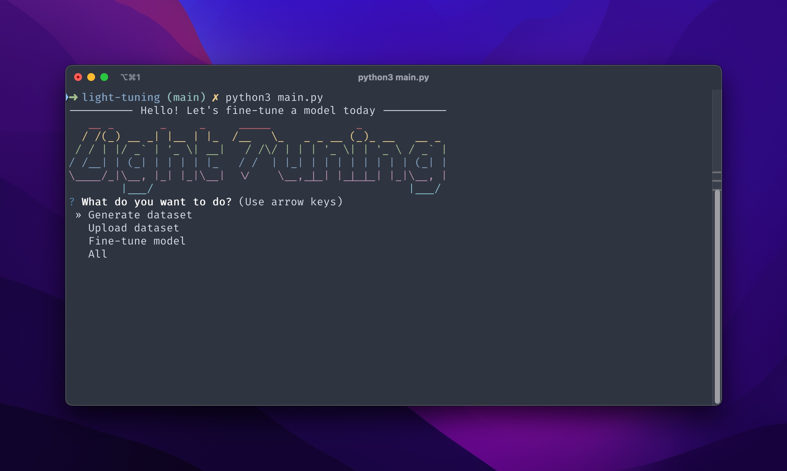

<p align="center">
  
  <h1 align="center">LightTuning</h1>
</p>

<p align="center">
  🤖 CLI to fine-tune GPT-3.5 Turbo models rapidly. 💬
</p>



## 🚀 Concept

**LightTuning** is a quick way to fine-tune GPT-3.5 Turbo models. To scale and enhance a model from a small conversation to a light GPT-3.5 model that can overperform GPT-4. How cool is that?

## 🧑‍💻 Usage

Run the main.py script to start the tool.

```bash
python3 main.py
```

You will be greeted with a welcome message and a list of actions to choose from:

- Generate dataset
- Upload dataset
- Fine-tune model
- All

Select an action using the arrow keys and press Enter.

### Generate Dataset

If you choose 'Generate dataset', you will be asked to provide the path to the seed conversation. If you don't provide a path, LightTuning will ask you to enter it.

Add a seed conversation to the file. The conversation should be in the following OpenAI conversation format:

```json
[
  {
    "role": "system",
    "content": "You are an assistant that can translate from English to Spanish."
  },
  {
    "role": "user",
    "content": "Hello"
  },
  {
    "role": "assistant",
    "content": "Hola"
  },
  {
    "role": "user",
    "content": "Happy"
  },
  {
    "role": "assistant",
    "content": "Feliz"
  }
]
```

### Upload Dataset

If you choose 'Upload dataset', you will be asked to enter the path to the dataset file. If you don't provide a path, the tool will ask you to enter it. You will then be asked to confirm the upload.

### Fine-tune Model

If you choose 'Fine-tune model', you will be asked to provide the file ID for fine-tuning. If you don't provide a file ID, the tool will ask you to enter it.

### All

If you choose 'All', the tool will execute all of the above actions in order.

## 📃 License

Distributed under the MIT License.
See [`LICENSE`](./LICENSE) for more information.
